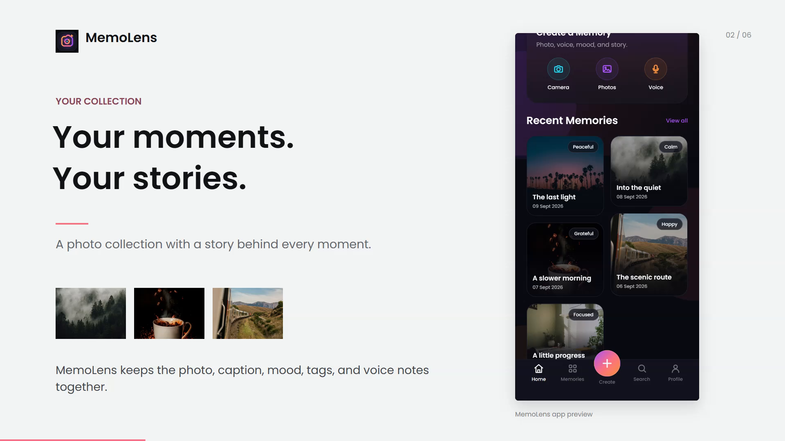
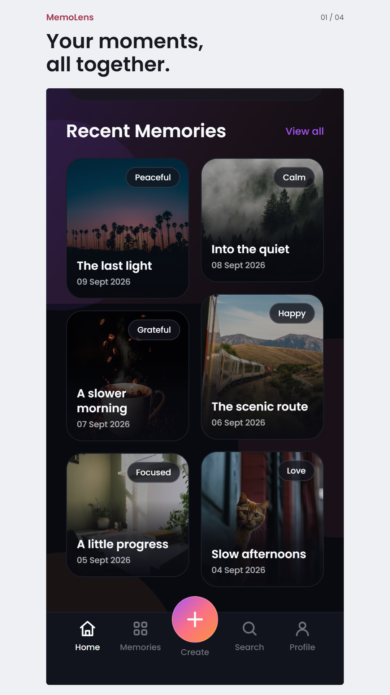
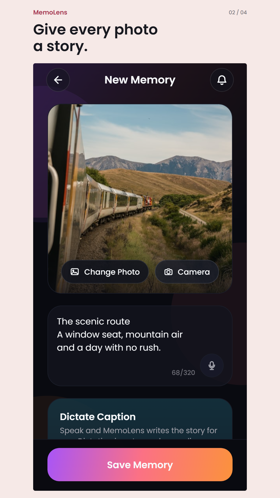
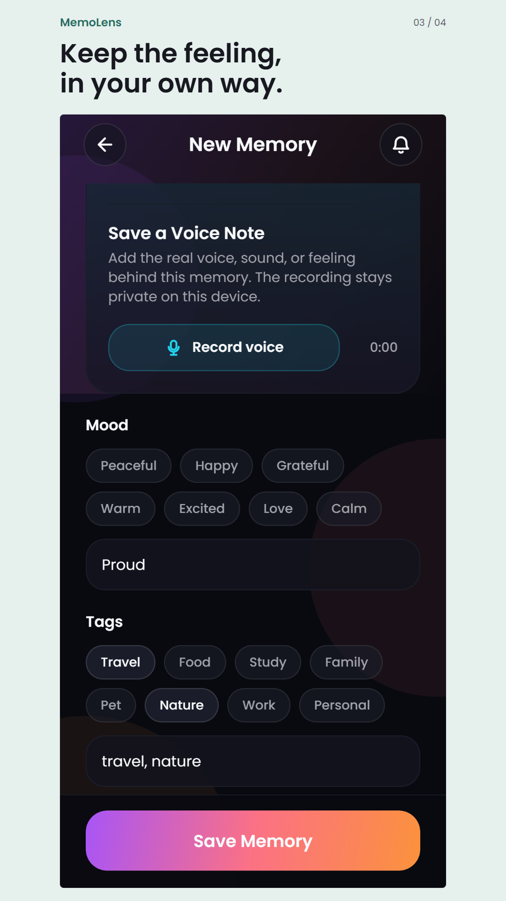
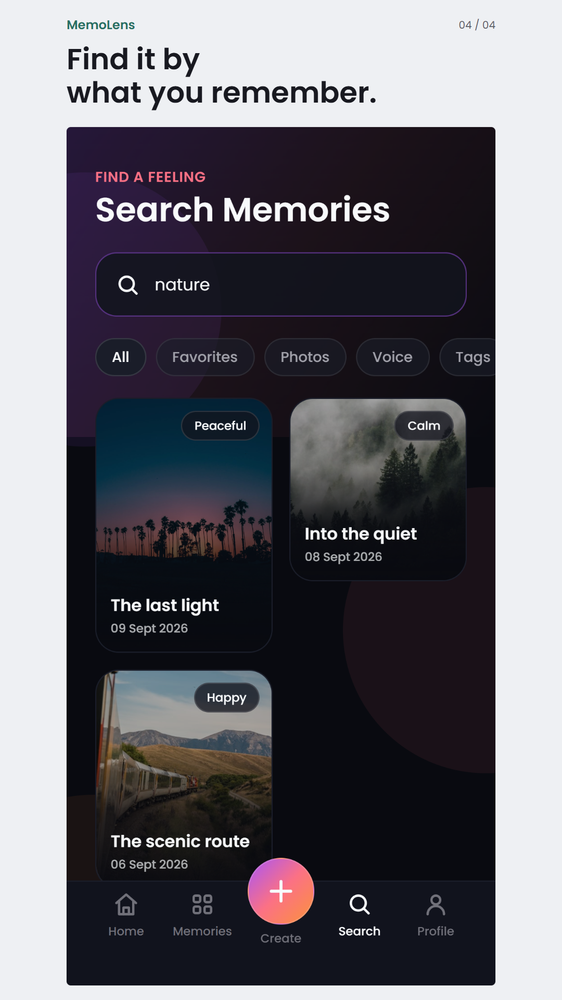

# MemoLens

**Save the photo. Keep the feeling.**

A local-first photo journal built with Expo and React Native. Keep a photo with its caption, mood, tags and an optional voice note, then search for the story behind it.

**Status: personal use and testing. Google Play production work is paused as of 11 September 2026.** The store listing has been saved, but public release and production access are not approved. This repository update does not change installed apps or publish an EAS update.

## App Demo

[](https://www.youtube.com/watch?v=bV9s-qFNM9c)

[Watch on YouTube](https://www.youtube.com/watch?v=bV9s-qFNM9c) | [Download the MP4](https://raw.githubusercontent.com/aby639/my-gallery/main/playstore-assets/2026-09-memolens/video/MemoLens-App-Demo-1080p.mp4) | [Captions](playstore-assets/2026-09-memolens/video/MemoLens-captions.srt)

The 43-second, 1080p walkthrough shows the actual app's web renderer: browsing memories, adding a photo and caption, choosing a mood and tags, saving, and searching. It uses demonstration data, synthetic narration and a locally generated instrumental bed. Native microphone recording is described, not demonstrated as a successful web recording. See [media provenance and limits](playstore-assets/2026-09-memolens/README.md).

## Screens

<table>
  <tr>
    <th>Collection</th>
    <th>Photo story</th>
    <th>Moods and voice</th>
    <th>Search</th>
  </tr>
  <tr>
    <td></td>
    <td></td>
    <td></td>
    <td></td>
  </tr>
</table>

These compositions contain real web-app captures, not iPhone mockups or generated UI. The [media pack](playstore-assets/2026-09-memolens/README.md) also includes separately captured tablet viewports, the unchanged approved icon and the new feature graphic. Compare the captures against native Android devices before a future store submission.

## What Works

- Start privately without signing in, or use configured Google sign-in.
- Add a photo from the camera or library without a forced crop.
- Write a caption or use device-supported speech recognition for dictation.
- Record and replay voice notes in the native Android/iOS build.
- Organise memories with moods, custom mood labels, tags and favourites.
- Search captions, moods and tags; filter favourites and memories with voice notes.
- Edit or delete memories and share saved images through the native share sheet.
- View local storage information, clear local memories and sign out from Settings.

The current interface is dark. Light-mode switching, cloud backup/sync, OCR, AI captions, biometric locking and branded share cards are not current features.

## Storage And Platform Limits

Memories are stored on the device. Google sign-in does not back up or synchronise the collection, and signing out does not erase it. Treat clearing app data or uninstalling as potentially destructive; there is no in-app backup/export workflow yet.

Google authentication and the device's speech service may use the network. Local-first storage is not a claim that every feature works offline or that speech never leaves the device. Voice-note recording is unavailable in the web preview. Native camera, microphone, sharing and sign-in require testing in a configured native build, not just a browser preview.

## Development

The app uses Expo SDK 54, React Native 0.81, React 19 and TypeScript, with React Navigation, AsyncStorage, Expo Image Picker, Expo Audio, Expo Speech Recognition, Expo Sharing and Google Sign-In. Dependencies are recorded in [package.json](package.json) and the lockfile.

Install the locked dependencies:

```bash
npm ci
```

On Windows PowerShell, create the local environment file:

```powershell
Copy-Item .env.example .env
```

Configure the Google OAuth client IDs and hosted privacy-policy URL listed in [.env.example](.env.example). Do not commit `.env`, credentials or signing keys. The `EXPO_PUBLIC_*` values are bundled into the client and must never contain secrets; see [Expo's environment-variable guidance](https://docs.expo.dev/guides/environment-variables/). Use **Start privately** when Google sign-in has not been configured.

| Command | Purpose |
| --- | --- |
| `npm start` | Start Expo development server |
| `npm run android` | Build/run Android with the native toolchain |
| `npm run ios` | Build/run iOS on macOS with Xcode |
| `npm run web` | Start the web preview |
| `npm test` | Run Jest tests |
| `npm run typecheck` | Check TypeScript |

### Google Sign-In

Android package and iOS bundle identifier: `com.ablespace.mygallery`.

Android OAuth configuration must match the certificate used to sign the installed build. Debug, EAS and Google Play app-signing certificates can differ. See the platform checks in [authConfig.ts](src/auth/authConfig.ts) and the native implementation in [nativeGoogleSignIn.ts](src/auth/nativeGoogleSignIn.ts).

## Release Notes

The checked-in app version is **1.2.3**, with Android `versionCode` **15** in [app.json](app.json). [eas.json](eas.json) uses remote version management and production auto-increment, so a future EAS build may have a different build number. Native changes also need a runtime-compatibility review before an OTA update; see [Expo runtime versions](https://docs.expo.dev/eas-update/runtime-versions/).

Publication is on hold, not cancelled. Existing installed builds remain available to their owners. There is no public Play Store download link in this README because production has not been released.

- [Release status and resumption checklist](docs/release-status.md)
- [Build/update workflow and product roadmap](docs/release-and-product-plan.md)
- [Current store listing copy](docs/play-store-listing-draft.md)
- [Approved demo and current image pack](playstore-assets/2026-09-memolens/README.md)
- [Changelog](CHANGELOG.md)

The older `production-v4-wow` assets are retained as an archive, not the current upload pack. Unfinished video experiments remain excluded.
