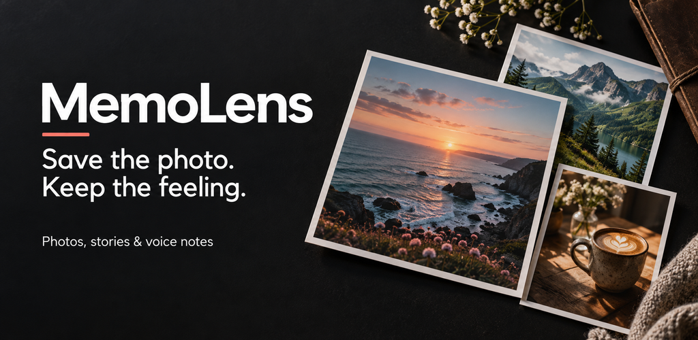

# MemoLens Media Pack - September 2026

Current prepared image pack and approved app walkthrough. This supersedes the older `production-v4-wow` pack for documentation and future review. Google Play production work is [paused](../../docs/release-status.md); these files are not proof of a published app or native-device validation.

## Feature Graphic

## Files

| Asset | Path | Format |
| --- | --- | --- |
| Approved app icon | [app-icon-512.png](app-icon-512.png) | 512 x 512 PNG, unchanged |
| Feature graphic | [feature-graphic-1024x500.png](feature-graphic-1024x500.png) | 1024 x 500 PNG |
| Phone compositions | [phone](phone/) | Four 1080 x 1920 PNGs |
| 7-inch tablet review set | [tablet-7-inch](tablet-7-inch/) | Four 1296 x 2304 PNGs |
| 10-inch tablet review set | [tablet-10-inch](tablet-10-inch/) | Four 1620 x 2880 PNGs |
| App walkthrough | [MemoLens-App-Demo-1080p.mp4](video/MemoLens-App-Demo-1080p.mp4) | About 43 seconds, 1920 x 1080, 30 fps, H.264/AAC |
| Video poster | [poster.png](video/poster.png) | 1920 x 1080 PNG |
| Video captions | [MemoLens-captions.srt](video/MemoLens-captions.srt) | SRT |
| File checksums | [manifest.json](manifest.json) | Byte lengths, dimensions and SHA-256 hashes |

Watch the [YouTube demo](https://www.youtube.com/watch?v=bV9s-qFNM9c), or use the repository MP4. No unfinished Higgsfield/Gemini/video experiments or raw render intermediates are included.

## Provenance

**App captures.** Generated on 10 September 2026 from the actual Expo web export at [commit 64e0766](https://github.com/aby639/my-gallery/tree/64e0766), using isolated browser contexts and demonstration records. Photos came from the existing `assets/memolens` folder. No personal gallery, signed-in browser session or account-console screenshot is included. Phone captures are placed in aligned compositions without a device bezel. Each tablet set was captured at its own viewport, not made by stretching a phone screenshot.

**Feature graphic.** AI-generated illustrative marketing artwork, resized to the exact export dimensions. It is not a screenshot or photograph of the running app. The existing approved app icon is preserved byte-for-byte; its original creation method is not established by this update.

**Video.** Actual web-app states show browsing, creating and saving a memory, searching and opening a result. The edit uses a deterministic Canvas timeline, WebCodecs video encoding and FFmpeg packaging. It is not the rejected, unrelated generative-video experiment.

**Audio.** Synthetic narration was excerpted from an existing local MemoLens voiceover; an unsupported branded-share-card claim was removed. The instrumental bed was synthesised locally for this edit. The original voice provider and its licence have not been independently verified. No commercial music track was imported.

**Fonts and photographs.** Poppins is used under the bundled [font licence](Poppins-LICENSE.txt). Existing repository photographs were reused without independently establishing each upstream source/licence. This pack does not grant new rights to those photographs, the icon or the synthetic voice. Keep their rights review on the release checklist.

## Validation And Limits

- Image dimensions and file hashes are recorded in `manifest.json`. All twelve phone/tablet images are 9:16 and below 8 MB each. Compare against [Google Play's current asset requirements](https://support.google.com/googleplay/android-developer/answer/9866151?hl=en) when resuming publication.
- The original capture checks exercised private start, saving captions/moods/tags, search matching and opening a result, without JavaScript page errors.
- The finished video passed a full decode and browser playback/seek checks at desktop and mobile viewport sizes. The original audio check measured approximately -16.1 LUFS integrated loudness and -4.31 dBTP.
- These are **web-renderer captures**, not certified Android phone/tablet screenshots. Native safe areas, camera, speech recognition, recording/playback and device performance still require native checks.
- Voice-note recording is explicitly unavailable in web preview. The video explains that feature without faking a completed native recording.
- Mechanical video checks do not certify narration pronunciation, every caption boundary or media rights. Review those before wider publication.
